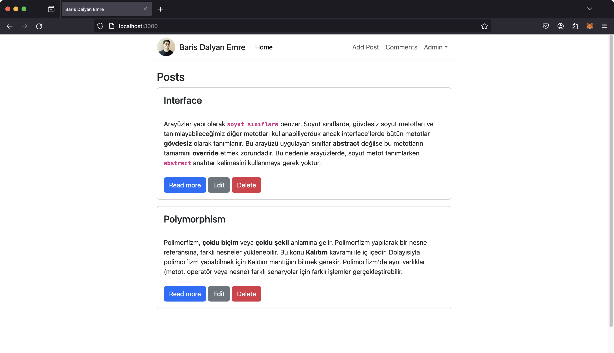
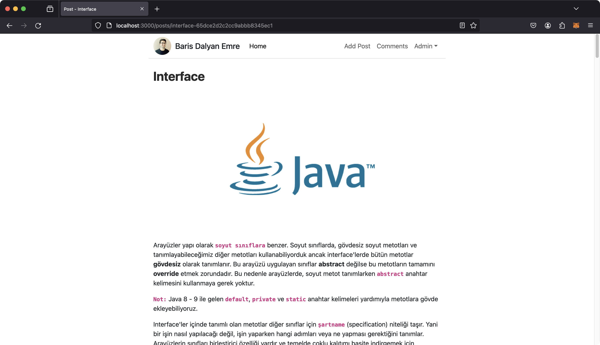
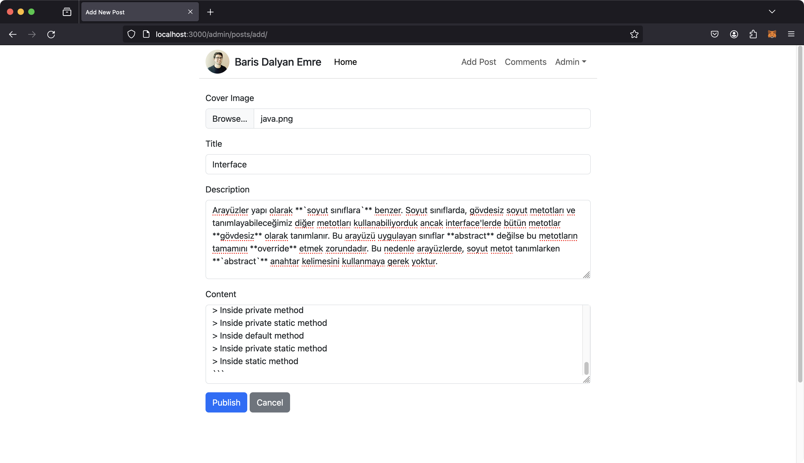
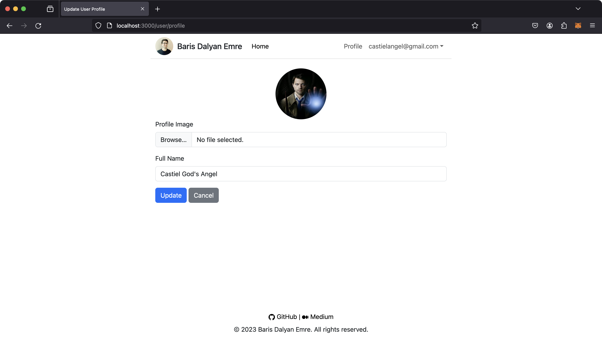
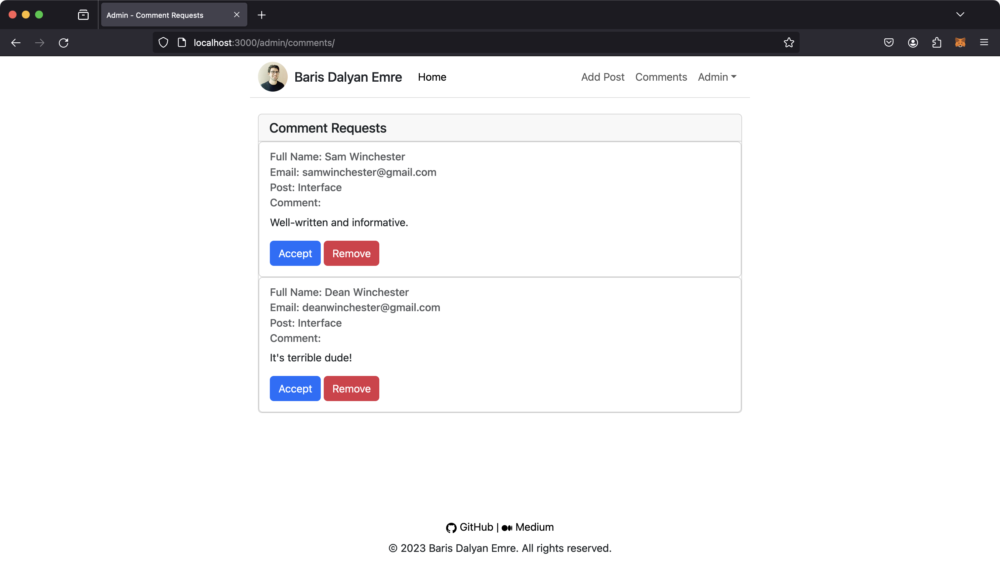
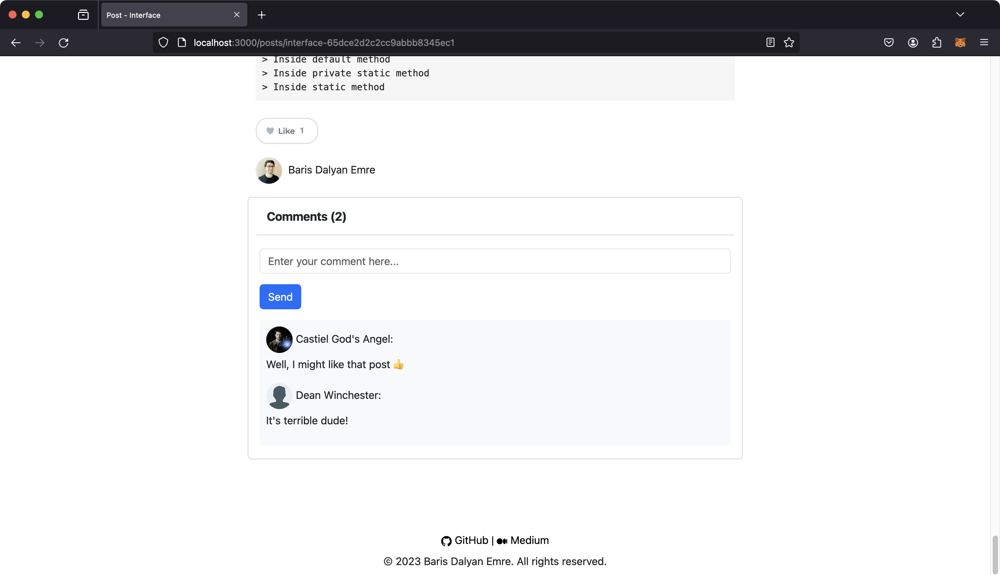

# Markdown Blog App

## Built With 🔨

- Express.js
- MongoDB
- EJS
- Bootstrap

## Features

**Markdown support**

You can publish and edit your blog posts in Markdown format.

**Throttling**

When you make three consecutive incorrect sign in attempts within one minute, you will be temporarily banned for 5 minutes.

**Profile**

Users can update their profile pictures and names.

**Interaction**

Users can comment and like the posts.

## How to use

- Clone the repository and fill in the relevant places in the `.env` file or leave as it is.

```
MONGODB_URI=mongodb://mongodb:27017/markdownblogappdb
PORT=3000
```

- Run the following command:

```
docker-compose up
```

## Screenshots



<hr>



<hr>



<hr>



<hr>



<hr>



## License

This project is released under the MIT License.
